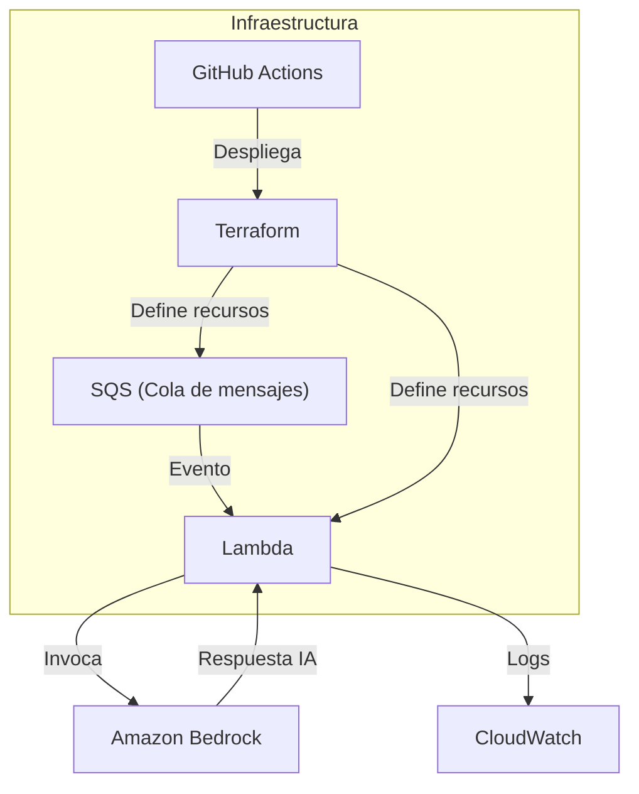

## Charla

En esta sesión práctica veremos cómo construir un microservicio event-driven que procesa eventos en tiempo real y los enriquece con IA generativa usando Amazon Bedrock. Automatizaremos la creación de la infraestructura con CloudFormation y configuraremos un pipeline CI/CD en AWS para desplegar de forma continua y segura. Ideal para quienes quieren pasar de la idea al despliegue en una sola charla.

## Arquitectura

aws logs tail /aws/lambda/eda-bedrock-consumer --follow# Arquitectura AWS - Proyecto Event Driven

Este documento describe la arquitectura implementada en el proyecto, basada en infraestructura como código (Terraform) y AWS Lambda.

## Componentes principales

- **AWS Lambda**: Función que ejecuta código en respuesta a eventos. El código fuente está en `terraform/lambda_src/handler.py` y se empaqueta como `lambda.zip`.
- **Terraform**: Utilizado para definir y desplegar la infraestructura en AWS. Los archivos principales están en la carpeta `terraform/`.
- **GitHub Actions**: Workflow automatizado (`.github/workflows/terraform-deploy.yml`) para desplegar la infraestructura en AWS usando OIDC y credenciales temporales.

## Flujo de despliegue

1. **Push a rama main**: El workflow se activa al hacer push a la rama principal.
2. **Empaquetado Lambda**: Si no existe `lambda.zip`, se crea a partir del código fuente en `lambda_src/`.
3. **Terraform Init/Plan/Apply**: Se inicializa Terraform, se valida la configuración, se genera el plan y se aplica automáticamente.
4. **Credenciales AWS**: Se usan credenciales temporales vía OIDC para mayor seguridad.

## Diagrama de arquitectura

## Archivos relevantes

- `terraform/main.tf`: Define los recursos principales.
- `terraform/variables.tf`: Variables de configuración.
- `terraform/outputs.tf`: Salidas de Terraform.
- `terraform/lambda_src/handler.py`: Código fuente de Lambda.
- `.github/workflows/terraform-deploy.yml`: Workflow de despliegue.

## Seguridad

- Uso de OIDC para autenticación segura entre GitHub y AWS.
- Variables y secretos gestionados en GitHub Actions.

## Extensiones

- Se puede ampliar la arquitectura agregando más funciones Lambda, triggers de eventos (S3, DynamoDB, etc.), y otros servicios AWS según necesidades del proyecto.
